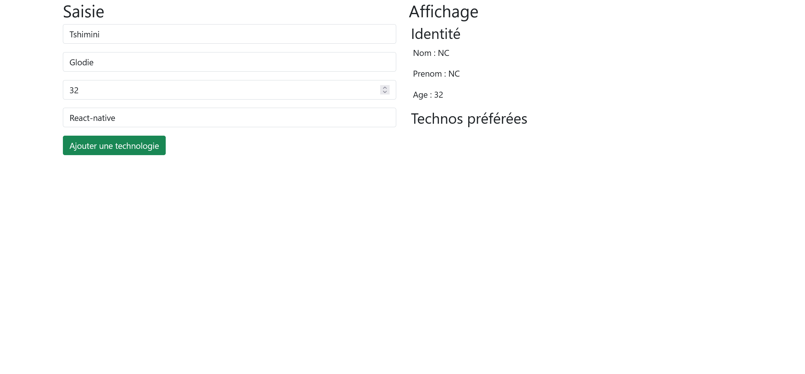

# Exercice 2 : manipulation du DOM

---

## Enoncé

1. A l'aide des événements et du DOM, affichez les informations saisies dans le formulaire de gauche en direct sur la partie droite du document HTML

### Spécifications techniques

1. Un langage ou une techno est ajouté à partir du bouton
4. Les langages et les technos doivent être affiché sous la forme d'une liste à puces.
5. Si l'âge est supérieur ou égal à 18 ans, affichez le message "vous êtes majeur(e)", sinon affichez "Vous êtes mineur(e)"

---

## Bonus

1. Désactivez le bouton "ajoutez une techno" lorsque le champ de saisie de la techno est vide.
2. Ajoutez des boutons de suppression aux technos ajoutées.

---

## Illustration

