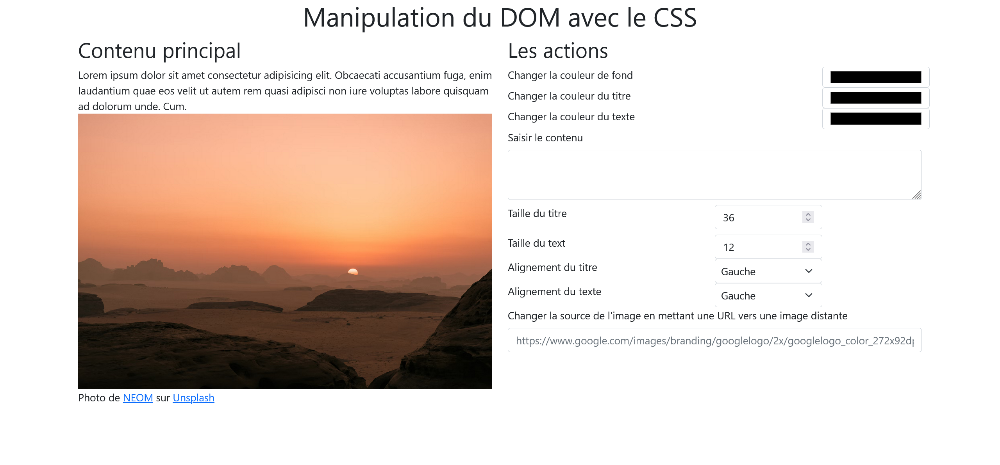

# Exercice 3 : manipulation du DOM partie Javascript

A l'aide des évènements, modifiez les propriétés CSS ou le contenu des éléments du bloc de gauche.
Les actions à effectuer :
- Ajoutez les options des sélections depuis javascript ;
- Modifiez la couleur de fond ;
- Modifiez les couleurs du titre et du texte ;
- Modifiez les alignements du titre et du texte ;
- Modifiez ou ajoutez du contenu au texte initial ;
- Modifiez les tailles du titre et du texte ;
 - Modifiez l’apparence du curseur au survol de l'image en afffichant tout en haut de la page le message "Vous êtes en train de survoler l'image" ;
 - Et tout ce qui vous passe par la tête

### Maquette de la page version desktop (bureau)

