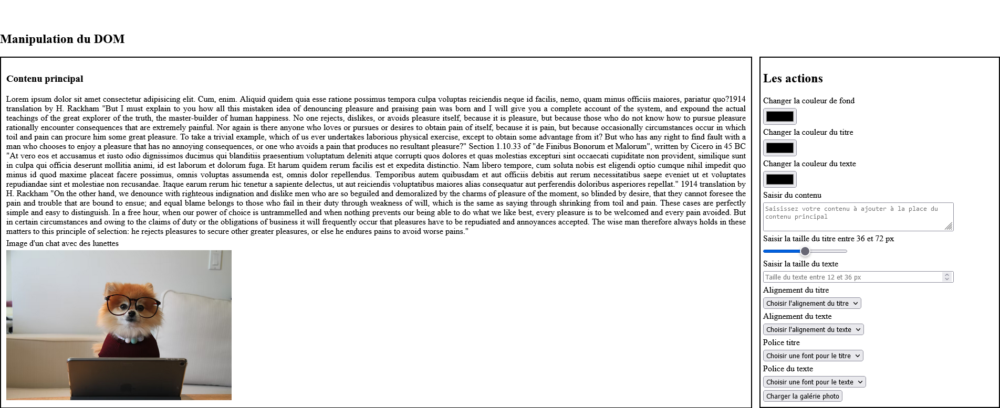
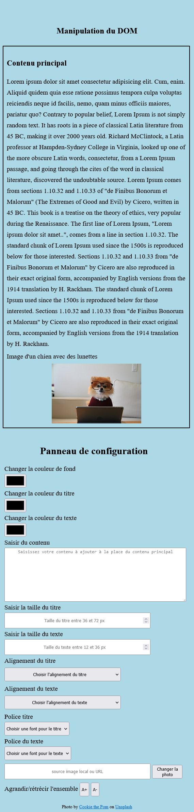
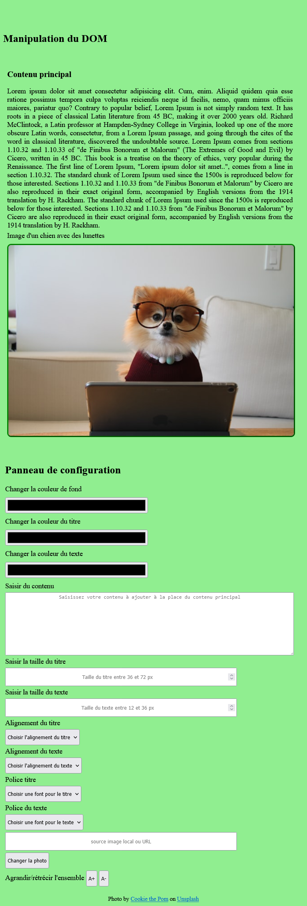

# Exercice 4 : Manipulation media queries avec JavaScript

## Enoncé

A partir de l'exercice 3, modifiez les propriétés CSS de la page pour les versions tablette et mobile en utilisant matchMedia.

---

## Maquette de la page version desktop (bureau)

---

## Maquette de la page version mobile

---

## Maquette de la page version tablette

