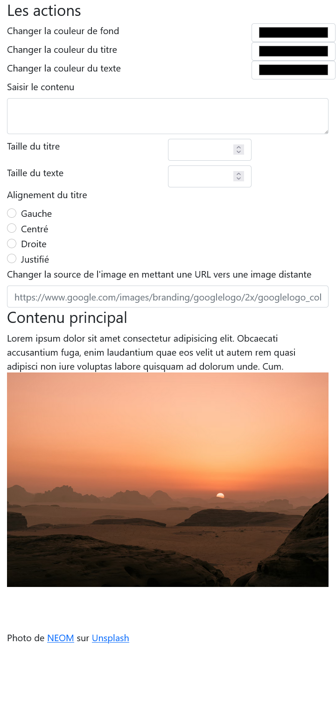

# Exercice 4 : manipulation media queries avec JavaScript

## Énoncé

A partir de l'exercice 3, modifiez les propriétés CSS de la page pour la version mobile en utilisant ***matchMedia*** et l'événement ***[resize](https://www.w3schools.com/jsref/tryit.asp?filename=tryjsref_onresize_window)**.

## Spécifications techniques

- Faire les modifications suivantes en JS et lorsque la fenêtre à une largeur inférieure ou égale à ***576px***
- à la balise main, ajoutez la classe row-reverse
- Remplacer les ***select*** de l'alignement du titre et du texte par des [boutons radios](https://www.w3schools.com/tags/att_input_type_radio.asp) (`<input type="radio">`)
- Remplacer l'input de type `number` par un input de type `range`.

---

## Maquette de la page version mobile

