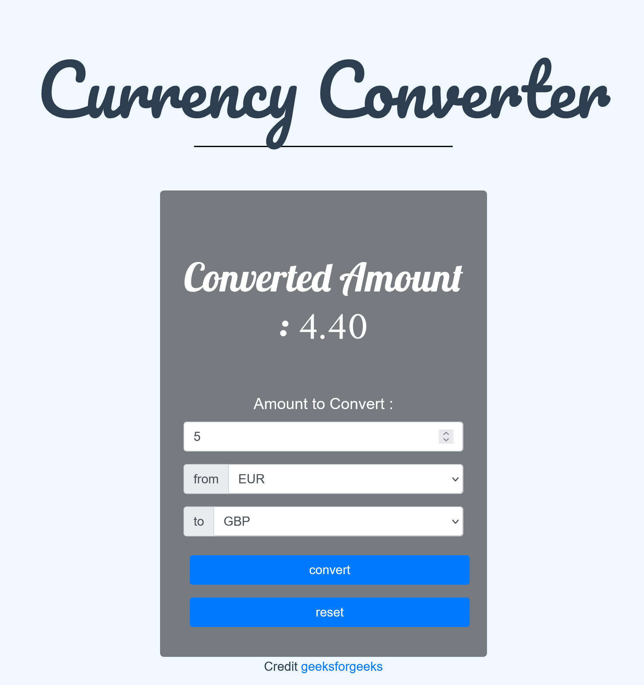

# Bonus 2 : API devises 
---

## Enoncé

1. Récupérez les fichiers sources du template [convertisseur de devises](./ressources/convertor.zip)
2. Réalisez le convertisseur de monnaie.

### Illustration

